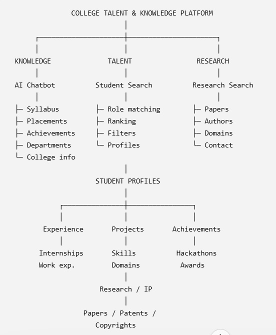

# 🎓 College Admin & Academic Collaboration Copilot

> **AI-Powered Academic Intelligence Platform for Vishwakarma Institute of Technology (VIT), Pune**
>
> Autonomous Institute | NAAC A++ Accredited | Affiliated to Savitribai Phule Pune University (SPPU)

---

## 🎬 Demo Video

[](https://drive.google.com/file/d/1048r6G9wobJMX2xguyo58eR-U-UZi-cS/view?usp=sharing)

---

## 📌 Overview

The **College Admin & Academic Collaboration Copilot** is a full-stack AI-powered administrative intelligence platform purpose-built for VIT Pune. It combines **Retrieval-Augmented Generation (RAG)**, **semantic vector search**, **LLM-powered advisory responses**, and **structured student analytics** into a single unified web application.

Instead of searching through dozens of PDFs and spreadsheets, administrators, faculty, placement officers, and students can simply ask natural language questions and get structured, accurate, officially grounded answers.

---

## ✨ Key Features

### 📚 1. Knowledge Copilot (RAG over 33 Official Documents)
- Answers questions from **33 official VIT Pune PDFs** — syllabi, exam rules, fee structures, academic calendars, scholarship notices, and institutional policies.
- Powered by the **`openai/gpt-oss-120b`** model via Groq API for rich, human-friendly responses.
- **Zero Hallucination** — every answer is strictly grounded in official document excerpts with page-level citations.
- **4-Part Human-Friendly Response Format:**
  - 📌 Direct summary
  - 📋 Official rules & tables
  - 💡 Student guidance & next steps
  - 📄 Source document citations

### 👥 2. Talent Repository & Student 360 Intelligence
- **1,000 verified synthetic student profiles** across 7 departments.
- Multi-factor filter: Branch, Year, Minimum CGPA, Domain, Hackathon/Internship participation.
- **Student 360 Profile** with CGPA, career track inference, projects, internships, hackathons, certifications.
- **AI Smart Role Recommender** that respects active filters (Branch, Year, CGPA) before scoring candidates.

### 🔬 3. Research & IP Explorer
- **377 research papers** and **77 patents/copyrights** across 16 engineering domains.
- **Natural Language Search** — handles queries like *"research papers on computer vision published in 2025"* or *"patents related to electric vehicles"*.
- Automatic year detection, typo-resilient keyword matching, and relevance-based ranking.

### 🎫 4. Grievance Desk
- Students can submit academic complaints (grade issues, exam revaluation, fee receipts).
- Generates formal tracking Ticket IDs and logs records for administrative review.

---

## 🏗️ System Architecture



```
┌─────────────────────────────────────────────────────────────────────────┐
│                        USER (Browser)                                   │
│                  React 18 + Vite + Tailwind CSS                         │
│          Knowledge Copilot │ Talent Hub │ Research │ Grievance           │
└──────────────────────────────────┬──────────────────────────────────────┘
                                   │ HTTP (port 8000)
                                   ▼
┌─────────────────────────────────────────────────────────────────────────┐
│                     FastAPI Backend (Uvicorn)                            │
│                                                                         │
│  ┌─────────────────┐  ┌──────────────────┐  ┌──────────────────────┐  │
│  │  /chat endpoint  │  │ /api/platform/*  │  │ /api/intelligence/*  │  │
│  │                 │  │                  │  │                      │  │
│  │ Intent Router   │  │ Talent Filter    │  │ Student 360          │  │
│  │ (keyword + LLM) │  │ Research Search  │  │ Portfolio Builder    │  │
│  │                 │  │ Knowledge Ovrvw  │  │ AI Recommender       │  │
│  └────────┬────────┘  └──────────────────┘  └──────────────────────┘  │
│           │                                                             │
│  ┌────────▼────────────────────────────────────────────────────────┐   │
│  │                      RAG Pipeline                               │   │
│  │                                                                 │   │
│  │  Query → sentence-transformers (all-MiniLM-L6-v2)              │   │
│  │       → FAISS Vector Search (2,478 PDF chunks)                 │   │
│  │       → Relevance Check → Groq LLM (gpt-oss-120b)             │   │
│  │       → Structured Markdown Answer + Citations                 │   │
│  └─────────────────────────────────────────────────────────────────┘  │
│                                                                         │
│  ┌────────────────────────────────────────────────────────────────┐    │
│  │                     Data Layer                                 │    │
│  │  33 Official PDFs  │  8 Student CSV Datasets  │  FAISS Index  │    │
│  └────────────────────────────────────────────────────────────────┘    │
└─────────────────────────────────────────────────────────────────────────┘
```

### Component Flow

```
User Question
      │
      ▼
 Intent Classifier (keyword rules + Groq LLM fallback)
      │
      ├─── greeting         → Warm welcome message
      ├─── policy_question  → FAISS retrieval → LLM answer with citations
      ├─── research_paper_search → NLP query parser → Research CSV search
      ├─── student_match    → Student dataset search
      ├─── project_search   → Academic/Industry project datasets
      ├─── hackathon_search → Hackathons dataset
      ├─── internship_search → Internships dataset
      ├─── certification_search → Certifications dataset
      └─── complaint        → Grievance ticket creation
```

---

## 📂 Project Structure

```
college_copilot/
├── app/
│   ├── api/
│   │   ├── chat.py           # /chat endpoint — intent routing & RAG pipeline
│   │   ├── intelligence.py   # Student 360, Portfolio, AI Recommender APIs
│   │   └── platform.py       # Talent filter, Research search, Knowledge overview
│   ├── datasets/
│   │   └── service.py        # CSV reading, FAISS dataset search
│   ├── intelligence/
│   │   ├── recommender.py    # Filter-aware AI role recommender
│   │   ├── student_profile.py # Student 360 aggregation
│   │   └── portfolio.py      # Portfolio builder
│   ├── rag/
│   │   ├── chunker.py        # PDF text chunker (1200 char, 200 overlap)
│   │   ├── embedder.py       # sentence-transformers embedding
│   │   ├── generator.py      # LLM answer generation (Groq 120B)
│   │   ├── loader.py         # PDF loader (PyMuPDF)
│   │   ├── retriever.py      # FAISS similarity search
│   │   └── vector_store.py   # FAISS index save/load
│   ├── router/
│   │   └── intent.py         # Intent classifier (keyword + LLM)
│   └── main.py               # FastAPI app entry point
├── config/
│   └── datasets.json         # Dataset registry (paths, metadata)
├── data/
│   ├── csv/                  # 8 verified student datasets (CSV)
│   │   ├── students_master.csv
│   │   ├── academic_projects.csv
│   │   ├── industry_projects.csv
│   │   ├── internships.csv
│   │   ├── hackathons.csv
│   │   ├── certifications.csv
│   │   ├── research_papers.csv
│   │   └── patents_and_copyrights.csv
│   └── pdfs/                 # 33 Official VIT Pune PDFs
├── frontend/
│   ├── src/
│   │   ├── App.jsx           # Main React application
│   │   ├── main.jsx
│   │   └── index.css
│   ├── public/
│   │   └── vit_logo.png      # Official VIT Pune logo
│   ├── package.json
│   ├── tailwind.config.js
│   └── vite.config.js
├── scripts/
│   ├── ingest_all.py         # Full ingestion pipeline (PDFs + CSVs)
│   └── generate_vit_synthetic_data.py  # Synthetic student data generator
├── tests/                    # pytest test suite (8 tests)
├── .env.example              # Required environment variables
├── requirements.txt
└── README.md
```

---

## 📋 Official Documents Indexed

### 🏛️ Institutional & Policy Documents
| Document | Category |
|----------|----------|
| Mandatory Disclosure 2025-26 | Institutional Info |
| FRA Fee Structure AY 2026-27 | Fees & Finance |
| MahaDBT Scholarship Notice 2025-26 | Scholarships |
| VIT Information Brochure | General |
| VIT Best Practices | Institutional |
| VIT Organization Structure | Institutional |

### 📅 Academic Calendars
| Document | Description |
|----------|-------------|
| Academic Calendar 2026-27 (SY, TY, Final Year) | Semester I Dates & Holidays |
| Academic Calendar 2026-27 (First Year) | FY Semester Dates |
| Academic Calendar 2025-26 (Semester II) | Sem II Schedule |

### 📝 Examination & Assessment Rules
| Document | Description |
|----------|-------------|
| SGPA & CGPA Calculation | Formula & Rules |
| CPI to Percentage (Pre-2018) | Conversion Formula |
| Revised Assessment Guidelines 2025-26 | Evaluation Pattern |
| Instructions for Online MCQ (Post-2024) | Exam Rules |
| Instructions for Online MCQ (Pre-2024) | Exam Rules |
| Instructions for Offline Examinations | Exam Rules |
| Summer Term Registration (AY 2025-26) | Backlog Course Registration |

### 📄 Certificate & Administrative Forms
| Document |
|----------|
| Conversion Certificate |
| Duplicate Grade Sheet |
| Correction in Grade Sheet |
| No Backlog Certificate |
| Rank Certificate |
| Attempt Certificate |

### 📚 B.Tech Department Syllabi
| Department | Academic Year |
|-----------|--------------|
| Computer Engineering | 2025-26 |
| CSE — Artificial Intelligence Specialization | 2025-26 |
| Information Technology | 2025-26 |
| Artificial Intelligence & Data Science (AI & DS) | 2024-25 |
| Electronics & Telecommunication (E&TC) | 2025-26 |
| Mechanical Engineering | 2026-27 |
| Chemical Engineering | Latest |
| Instrumentation Engineering | Latest |
| Engineering Sciences & Humanities (DESH — FY) | 2025-26 |

---

## 🗂️ Student Data Datasets

| Dataset | Records | Description |
|---------|---------|-------------|
| `students_master.csv` | 1,000 | PRN, Branch, Year, CGPA, Domain, Technologies |
| `academic_projects.csv` | 1,460 | Mini/Major projects with domains & tech stack |
| `industry_projects.csv` | 678 | Industry-sponsored project experiences |
| `internships.csv` | 503 | Company, Role, Stipend, Duration |
| `hackathons.csv` | 532 | Event, Rank, Achievement |
| `certifications.csv` | 1,504 | Platform, Title, Domain |
| `research_papers.csv` | 377 | Title, Venue, Year, DOI, Domain |
| `patents_and_copyrights.csv` | 77 | IP Type, Filing Status, Domain |

---

## 🛠️ Tech Stack

| Layer | Technology |
|-------|-----------|
| **LLM** | Groq API — `openai/gpt-oss-120b` |
| **Embeddings** | `sentence-transformers/all-MiniLM-L6-v2` |
| **Vector Search** | FAISS (Facebook AI Similarity Search) |
| **PDF Processing** | PyMuPDF (`fitz`) |
| **Backend** | FastAPI + Uvicorn (Python 3.11+) |
| **Frontend** | React 18 + Vite + Tailwind CSS |
| **Markdown Rendering** | `marked.js` |
| **Icons** | Lucide React |
| **Testing** | pytest (8 tests) |

---

## 🚀 Getting Started

### Prerequisites
- Python 3.11 or higher
- Node.js 18+ and npm
- A **Groq API Key** (free at [console.groq.com](https://console.groq.com))

### 1. Clone the Repository

```bash
git clone https://github.com/SandeshAwate6055/College-Admin-Collaboration-Copilot.git
cd College-Admin-Collaboration-Copilot/college_copilot
```

### 2. Set Up Python Virtual Environment

```bash
python -m venv venv

# Windows
.\venv\Scripts\activate

# macOS / Linux
source venv/bin/activate

pip install -r requirements.txt
```

### 3. Configure Environment Variables

```bash
cp .env.example .env
```

Edit `.env` and add your Groq API key:

```env
GROQ_API_KEY=your_groq_api_key_here
GROQ_MODEL=openai/gpt-oss-120b
```

> 💡 Get a free Groq API key at [console.groq.com](https://console.groq.com)

### 4. Build the Knowledge Index

This command processes all 33 official PDFs and all 8 student CSV datasets into FAISS vector indexes:

```bash
# Windows
.\venv\Scripts\python.exe scripts\ingest_all.py

# macOS / Linux
python scripts/ingest_all.py
```

> ⏱️ This takes approximately 2–3 minutes to generate embeddings for ~2,500 chunks.

### 5. Build the Frontend

```bash
cd frontend
npm install
npm run build
cd ..
```

### 6. Start the Application

```bash
# Windows
.\venv\Scripts\python.exe -m uvicorn app.main:app --host 127.0.0.1 --port 8000 --reload

# macOS / Linux
python -m uvicorn app.main:app --host 127.0.0.1 --port 8000 --reload
```

Open your browser and visit:  
👉 **http://127.0.0.1:8000**

---

## 🧪 Running Tests

```bash
# Windows
.\venv\Scripts\python.exe -m pytest

# macOS / Linux
python -m pytest
```

Expected output: **7–8 passing tests** covering intent classification, RAG retrieval, dataset search, and student intelligence modules.

---

## 💬 Example Questions for the Knowledge Copilot

| Question | Source Document |
|----------|----------------|
| "What is the CGPA to percentage conversion formula?" | SGPA_CGPA_Calculation.pdf |
| "What are the summer term registration rules and credit limits?" | Summer-term-registration-AY-25-26.pdf |
| "What is the FRA approved fee structure for 2026-27?" | FRA-Fee-Structure-AY-2026-27.pdf |
| "What are the MahaDBT scholarship eligibility criteria?" | MahaDBT_Scholarship_Notice_2025_26.pdf |
| "What subjects are taught in B.Tech AI & Data Science?" | Syllabus_BTech_AI_DS.pdf |
| "What are the important exam dates for 2026-27?" | Academic_Calendar_2026_27.pdf |
| "What is the end semester examination date for Semester I?" | Academic_Calendar_2026_27_SY_TY.pdf |

## 🔍 Example Research Queries

| Query | What Happens |
|-------|-------------|
| `"i want research papers on computer vision published in 2025"` | Extracts year 2025, searches CV domain |
| `"patents related to electric vehicles"` | Detects patent intent, filters EV domain |
| `"deep learning 2024"` | Year auto-detected, keyword matched |
| `"robotics and automation papers"` | Token-based domain matching |

---

## 🖥️ Application Screenshots

### Knowledge Copilot
The chatbot answers questions from official VIT Pune documents with structured 4-part responses including citations.

### Talent Repository
Filter 1,000 students by branch, year, CGPA, domain, hackathon, and internship status with real-time results.

### Student 360 Profile
View a comprehensive student profile with CGPA, career track, projects, internships, hackathons, and certifications.

### Research & IP Explorer
Search 377 research papers and 77 patents using natural language queries with relevance-ranked results.

---

## 📡 API Reference

| Endpoint | Method | Description |
|----------|--------|-------------|
| `/chat` | POST | Natural language chat with RAG pipeline |
| `/api/platform/knowledge/overview` | GET | List all indexed PDF documents |
| `/api/platform/talent/filter` | GET | Filter students by branch/year/CGPA/domain |
| `/api/platform/research/search` | GET | Natural language research & patent search |
| `/api/intelligence/student/{prn}` | GET | Student 360 profile by PRN |
| `/api/intelligence/portfolio/{prn}` | GET | Full portfolio details by PRN |
| `/api/intelligence/recommend` | POST | AI role recommendation with filter support |
| `/tickets/{student_id}` | GET | View grievance tickets |

---

## 🔄 Re-Indexing Knowledge Base

When you add new PDFs to `data/pdfs/` or update student CSV files:

```bash
python scripts/ingest_all.py
```

---

## 🏫 About VIT Pune

**Vishwakarma Institute of Technology (VIT), Pune** is an autonomous engineering institute established in 1983, run by Bansilal Ramnath Agarwal Charitable Trust (BRACT), affiliated to Savitribai Phule Pune University, and accredited with NAAC A++ Grade. The institute offers B.Tech, M.Tech, and Ph.D. programs across 7 engineering departments.

🌐 [www.vit.edu](https://www.vit.edu)

---

## 📄 License

This project is built for academic and administrative purposes at VIT Pune. All official documents referenced belong to Vishwakarma Institute of Technology, Pune.

---

## 🙏 Acknowledgments

- **VIT Pune** for all official academic documents and institutional data
- **Groq** for the blazing-fast LLM inference API
- **FAISS** by Facebook AI Research for efficient vector similarity search
- **Sentence Transformers** (Hugging Face) for semantic embeddings
- **React + Vite + Tailwind CSS** for the modern frontend stack

---

*Built with ❤️ for smarter academic administration at VIT Pune*
